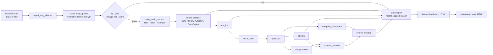
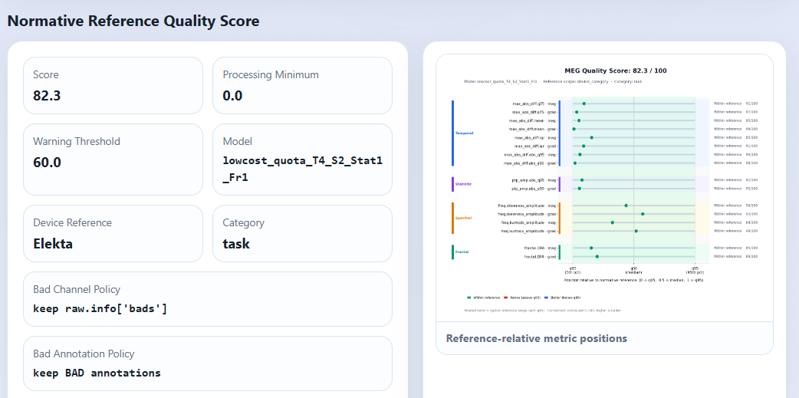
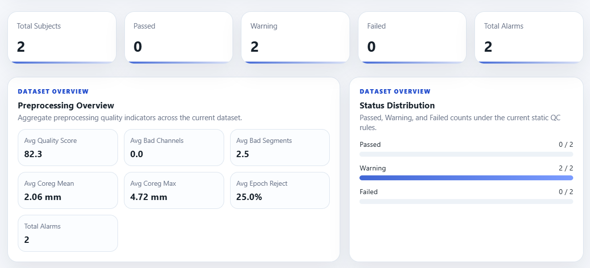
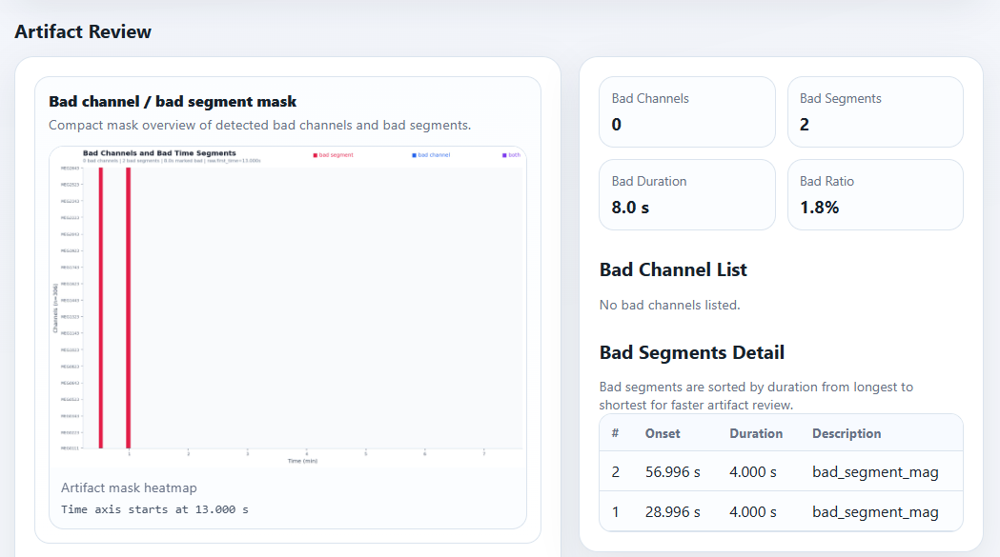
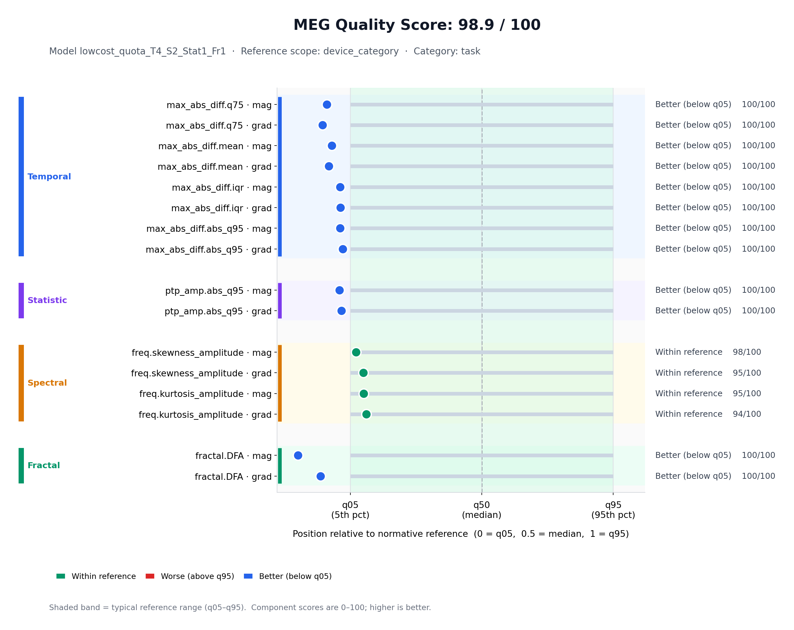
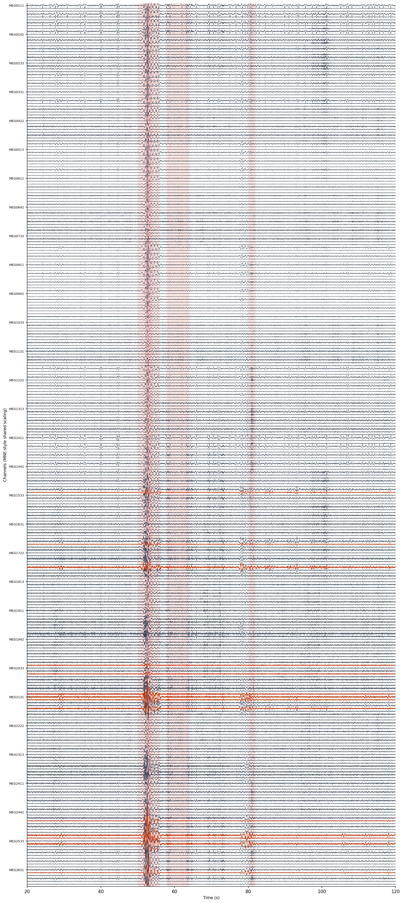
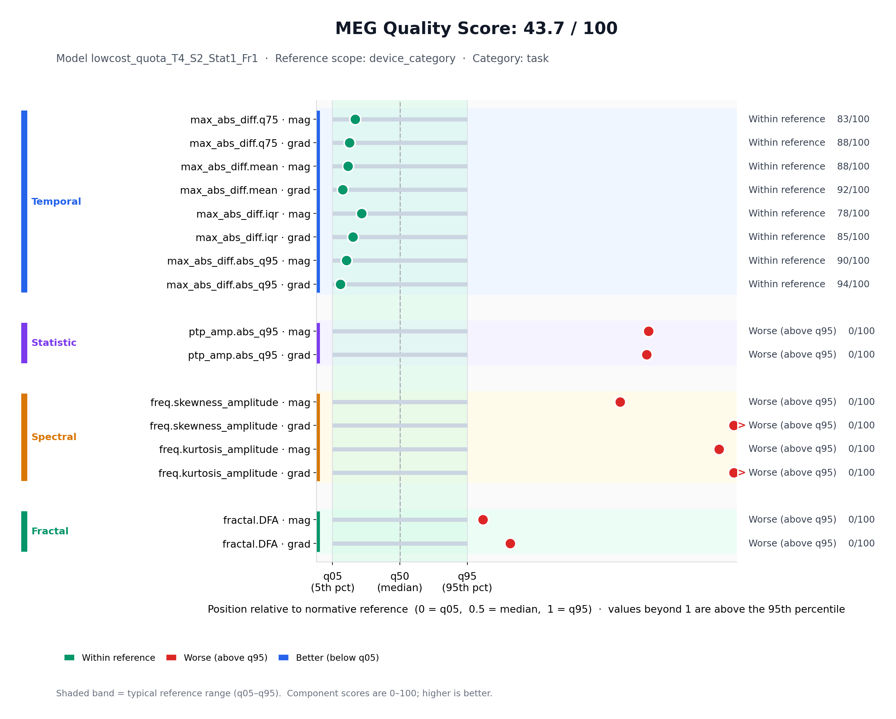
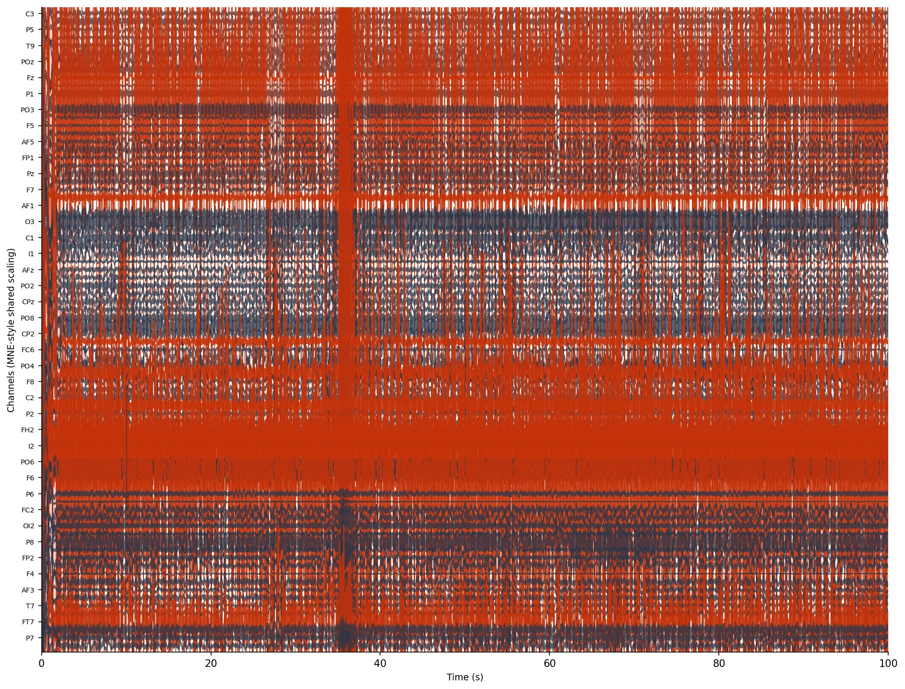
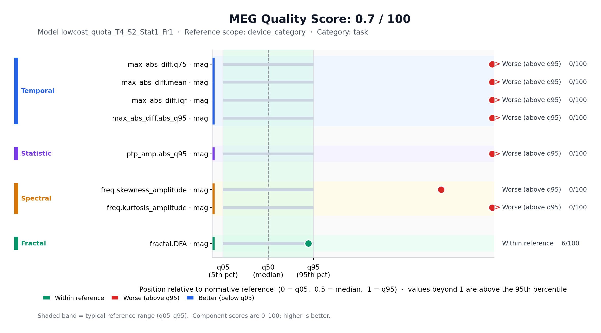

# MEGFlow：面向大规模脑磁图数据预处理、质量控制与队列级报告的可复现分析框架

**中文汇总报告（论文级技术报告草案）**  
**生成日期：2026-06-18**  
**代码库：`/data/liaopan/megprep`**  
**示例结果目录：`/data/liaopan/datasets/test_cohort_nx2/cohort_static_html_report`**

## 摘要

脑磁图（Magnetoencephalography, MEG）具有毫秒级时间分辨率，是研究人脑动态活动的重要技术。然而，大规模 MEG 数据集通常同时面临采集设备异构、数据格式不统一、伪迹类型复杂、MRI 配准依赖结构像、人工质控成本高、跨数据集批处理难以复现等问题。MEGFlow 针对这些痛点，构建了一套基于 Nextflow 和 MNE-Python 的模块化脑磁图预处理框架，并进一步扩展出多数据集 cohort-level 处理、Normative Reference 质量评分、DeepReject 自动坏道坏段检测、静态 HTML 报告和交互式复核等能力。

当前 MEGFlow 的核心设计思想是将 MEG 数据处理拆解为可复用、可缓存、可审计的流程节点：数据导入、Normative Reference 质量评分、基础预处理、伪迹检测、ICA、epochs、协方差估计、MEG-MRI coregistration、forward solution 和 source imaging。每个节点均由 Nextflow 调度，Python 模块负责具体算法实现，最终输出数据集级和队列级静态报告。示例 cohort 结果显示，MEGFlow 可在一个包含 7 个数据集、153 条记录的测试队列上统一完成质量评分、基础预处理和伪迹检测，并生成可离线查看的 cohort-level 报告。其中 SQUID 静息态数据表现出较高 Normative Reference 分数（如 SQUID-REST-ClosedEYE 平均 84.97，SQUID-REST-OPENEYE 平均 84.59），而 OPM 测试数据在当前参考空间下得分显著偏低（如 OPM-Artifacts 平均 2.91），说明该框架能够在跨设备、跨任务数据中提供明确的质量分层与复核入口。

## 1. 背景与问题定义

MEG 数据分析的难点不只在于单一算法，而在于从原始数据到可解释结果之间存在长链条依赖。典型流程需要先完成数据格式识别、基础滤波和重采样，再进行坏道、坏段、ICA 伪迹处理，随后依据任务事件生成 epochs，并在有结构像时继续完成 MRI 重建、头模型、配准、前向模型和源定位。对于单个 subject，人工运行这些步骤尚可接受；对于包含多个数据集、多个设备和多种任务状态的大规模 cohort，人工维护路径、参数、失败重跑和质量记录会迅速变得不可控。

MEGFlow 试图解决以下核心问题：

1. **可复现性问题**：不同机器、不同环境、不同人员运行同一数据集时，依赖版本与配置差异容易引入结果不一致。
2. **大规模调度问题**：多个 subject、多个 run、多个数据集之间存在大量独立任务，适合并行，但传统脚本难以稳健管理缓存与失败恢复。
3. **质控前置问题**：低质量数据如果直接进入 ICA、epochs 或源定位，会浪费计算资源并污染后续统计。
4. **跨数据集配置问题**：不同数据集可能使用不同 line-noise 频率、不同 MEG 设备、不同文件组织方式和不同结构像根目录。
5. **审计与复核问题**：处理完成后，研究者需要知道每个 subject 哪些步骤完成、哪些失败、哪些指标异常，并能追溯到具体图像、日志和 sidecar 文件。

## 2. 总体架构设计

MEGFlow 采用“Nextflow 调度 + Python 算法模块 + 静态报告聚合”的分层架构。



图 1 展示了 MEGFlow 运行时与 Nextflow 调度界面的典型输出。该界面记录流程名称、运行模式、任务状态、缓存复用和失败信息，是复现实验和排查问题的第一层证据。


### 2.1 工作流层：Nextflow DSL2

主流程文件为 `nextflow/megflow.nf`。当前流程中的主要 process 包括：

| 阶段 | Nextflow process | 主要输出 |
| --- | --- | --- |
| MRI 导入 | `import_mri_dataset` | T1 输入列表 |
| DICOM 转换 | `dcm2niix` | NIfTI 结构像 |
| 结构像重建 | `run_freesurfer` / `run_deepprep` | FreeSurfer subject |
| 头表面与 BEM | `run_mkheadsurf` / `generate_bem` | head surface, BEM |
| MEG 导入 | `import_meg_dataset` | `imported_meg_data.txt` |
| 质量评分 | `score_meg_quality` | `summary.json`, `component_scores.csv`, `reference_position.png` |
| 基础预处理 | `meg_basic_preproc` | `*_preproc-raw.fif` |
| 伪迹检测 | `detect_artifacts` | `*_bad_channels.txt`, `*_bad_segments.txt`, `deepreject_summary.json` |
| ICA | `run_ica`, `run_ic_label`, `apply_ica` | ICA 模型、标记成分、clean raw |
| Epochs | `epochs` | `*-epo.fif` |
| 协方差 | `compute_covariance` | `bl-cov.fif` |
| 配准 | `coregistration` | `coreg-trans.fif`, 距离统计与配准图 |
| 前向模型 | `forward_solution` | `*-fwd.fif` |
| 源定位 | `source_imaging` | source-level 输出 |
| 报告 | `generate_static_html_report`, `generate_cohort_static_html_report` | dataset/cohort 静态 HTML |

报告相关 process 已设置为 `cache false`，意味着报告默认重新生成，以便及时反映前序步骤的成功、失败、sidecar 变更和用户手动复核结果。

### 2.2 算法层：Python 模块化实现

MEGFlow 的算法模块集中在 `megflow/` 目录。代表性模块包括：

- `meg_import_dataset.py`：自动识别 BIDS 或 raw 数据集，支持 `.fif`、CTF `.ds` 等 raw 格式发现。
- `meg_quality_control.py` 与 `tools/megqc/score_meg_reference_quota_standalone.py`：实现 Normative Reference MEG QC 评分。
- `meg_preproc_osl.py`：执行基础滤波、陷波、重采样，以及可选 Maxwell/tSSS 等预处理。
- `meg_detect_artifacts.py`：整合 OSL、MNE、PyPREP 和 DeepReject 的坏道、坏段检测。
- `run_ica.py`、`run_ica_label.py`、`apply_ica.py`：ICA 拟合、自动标注与应用。
- `epochs.py`、`compute_covariance.py`、`coregistration.py`、`forward_solution.py`、`source_localization.py`：完成事件相关和源空间分析链路。
- `reports/static_html_report.py` 与 `reports/cohort_static_html_report.py`：生成 dataset-level 和 cohort-level 报告。

### 2.3 配置层：单数据集与多数据集统一入口

MEGFlow 使用 Nextflow config 暴露路径、步骤、滤波、QC、伪迹检测和报告参数。单数据集模式下，只需设置普通参数；cohort 模式下，可将 `dataset_dir` 作为多个数据集的父目录，并用 per-dataset override 处理设备和 line-noise 差异。

关键设计包括：

- `params.steps` 控制运行深度，例如 `meg_artifacts`、`meg_ica`、`meg_epochs`、`meg_all`、`all`、`report`。
- `cohort = true` 时，每个数据集独立输出到 `output_dir/datasets/<dataset_name>`，避免不同数据集中重复 subject id 互相覆盖。
- MRI 相关输出可按 dataset 隔离，避免多个数据集均存在 `sub-01` 时结构像处理结果冲突。
- `preproc_notch_freqs_by_dataset` 和 `megqc_notch_freqs_by_dataset` 支持在 cohort 中为不同数据集指定 50 Hz、60 Hz 或关闭 notch。
- `megqc_meg_vendor = "auto"` 支持自动推断设备类型，也可用 `megqc_meg_vendor_by_dataset` 为某些数据集固定 vendor。

## 3. 核心方法与创新点

### 3.1 Normative Reference 质量评分

MEGFlow 的重要扩展是将基于 Normative Reference 的质量评分前置到主流程开始阶段。每条原始 MEG 记录在基础预处理前先进入 `score_meg_quality`，输出 0-100 分质量分数、分域 family scores、逐指标 component scores 和 reference-position 图。

该评分模块默认使用固定的参考预处理：

- 1-100 Hz band-pass filter；
- config 显式指定的 notch filter；
- 不默认去除坏道与坏段，以保持与参考空间一致；
- 设备类型可自动推断或按数据集指定。

这一设计的关键价值是：质量评分既可作为报告告警，也可作为处理门控。`megqc_alarm_score` 用于报告提醒；`megqc_min_score` 用于控制低质量数据是否继续进入后续处理。换言之，研究者可以保留低质量数据的可视化证据，但避免其消耗 ICA、epochs、source imaging 等下游计算资源。

图 2 展示了静态报告中的 Normative Reference QC 模块。该模块同时呈现总分、处理阈值、告警阈值、模型名称、参考设备、任务类别、参考预处理配置和 metric family 结果。



### 3.2 Reference-relative metric positions

MEGFlow 不只输出一个总分，还将每个指标放回参考分布中解释。默认模型 `lowcost_quota_T4_S2_Stat1_Fr1` 覆盖四类指标：

| Domain | 指标族 | 解释 |
| --- | --- | --- |
| Temporal | `tsfel.max_abs_diff.*` | 反映相邻采样点变化，敏感于 spike、jump 和高频瞬态伪迹 |
| Spectral | `freq_domain.skewness_amplitude` | 反映频谱幅值分布偏斜，敏感于窄带峰或频率成分异常 |
| Spectral | `freq_domain.kurtosis_amplitude` | 反映频谱峰态，敏感于强窄带噪声 |
| Statistic | `tsfel.ptp_amp.abs_q95` | 反映高分位 peak-to-peak 幅值，敏感于大幅漂移或振荡 |
| Fractal | `fractal_domain.DFA` | 反映长程相关和非平稳结构 |

报告中使用科学计数法显示 raw、q05、q50、q95 等小数值，避免 MEG 量纲过小时全部显示为 `0.0000`。对于未计算的 channel type，例如某些 OPM 数据没有 grad，图中不再绘制缺失项。

### 3.3 DeepReject 与传统伪迹检测融合

`meg_detect_artifacts.py` 将传统规则与学习式检测结合：

- OSL：坏段与坏道检测；
- MNE：muscle z-score、break、amplitude 等 annotation；
- PyPREP：坏道检测；
- DeepReject：基于模型推理的坏道和坏段检测。

DeepReject 输出会合并到标准 sidecar：

- `*_bad_channels.txt`：坏道列表；
- `*_bad_segments.txt`：MNE annotation 形式的坏段；
- `deepreject_summary.json`：模型 backend、阈值、窗口数、坏段数、坏道数等摘要。

由于某些 FIF 文件存在非零 `raw.first_time`，DeepReject 写入 annotation 时会将 raw-relative interval 加上 `raw.first_time`，使坏段文件、报告横轴和红色坏段阴影处于同一 annotation/report 坐标系。

### 3.4 可复核的静态报告

MEGFlow 的静态报告是一个自包含 HTML 包，包含：

- dataset dashboard；
- workflow diagram；
- subject-level 详情页；
- alarm list；
- `subjects.csv` 和 `dataset_summary.json`；
- quality score 文件；
- artifact sidecar 文件；
- ICA、coregistration、epochs、source 等阶段图像；
- Nextflow `.command*` 日志摘要。

图 3 展示了 dataset dashboard 的信息组织方式。它将总分、坏道、坏段、配准距离、epoch 拒绝率、完成状态和告警优先级集中到一个入口中。



图 4 展示了 workflow diagram。该图由运行 manifest 和有效配置生成，会随 `steps` 模式变化，用于确认当前报告是否对应预期流程。


图 5 展示了 artifact 证据模块。除坏道、坏段表格外，MEGFlow 还生成全通道波形 overview 和 artifact mask heatmap，便于快速定位坏段集中出现的时间区间与异常通道。



### 3.5 Cohort-level 多数据集汇总

传统 MEG 预处理工具多以单数据集或单 subject 为中心。MEGFlow 在 cohort 模式中将父目录下多个数据集展开为独立 dataset run，并在最终生成 cohort-level 报告。该设计解决了三个常见问题：

1. **命名冲突隔离**：不同数据集均可存在 `sub-01`，输出位于各自 dataset 子目录。
2. **参数差异管理**：可按数据集覆盖 notch、QC vendor、QC preprocessing 等参数。
3. **跨数据集比较**：cohort 报告将多个 dataset 的 subjects、平均分、告警数、完成矩阵合并展示。

## 4. 示例结果：`test_cohort_nx2` 队列级报告

本报告引用的示例结果位于：

```text
/data/liaopan/datasets/test_cohort_nx2/cohort_static_html_report/index.html
```

该 cohort 结果生成时间为 `2026-06-05 00:03:50`，共包含 7 个数据集、153 条 MEG 记录。该示例运行完成至 `meg_artifacts` 相关阶段，因此所有记录均有 quality score、basic preprocessing 和 artifacts 结果；ICA、epochs、covariance、coregistration、headmodel 和 source imaging 在该示例中不是预期步骤。

### 4.1 Cohort 总体结果

| 指标 | 数值 |
| --- | ---: |
| 数据集数量 | 7 |
| MEG 记录数量 | 153 |
| PASS 数量 | 82 |
| WARN 数量 | 71 |
| FAIL 数量 | 0 |
| 告警数量 | 71 |
| 平均 Normative QC 分数 | 52.41 |
| 已评分记录 | 153 |
| 缺失评分记录 | 0 |
| QC warning 记录 | 71 |
| 完成 quality score | 153 / 153 |
| 完成 basic preprocessing | 153 / 153 |
| 完成 artifacts | 153 / 153 |

### 4.2 数据集级质量差异

| Dataset | 状态 | 记录数 | PASS | WARN | 平均 QC 分数 | QC 告警数 |
| --- | --- | ---: | ---: | ---: | ---: | ---: |
| OPM-Artifacts | WARN | 21 | 0 | 21 | 2.91 | 21 |
| OPM-REST-ClosedEYE | WARN | 21 | 0 | 21 | 4.35 | 21 |
| OPM-REST-OPENEYE | WARN | 16 | 0 | 16 | 4.55 | 16 |
| SQUID-Artifacts | WARN | 28 | 16 | 12 | 69.63 | 12 |
| SQUID-REST-ClosedEYE | WARN | 28 | 27 | 1 | 84.97 | 1 |
| SQUID-REST-OPENEYE | PASS | 18 | 18 | 0 | 84.59 | 0 |
| Z_BACK | PASS | 21 | 21 | 0 | 92.47 | 0 |

从结果看，SQUID REST 与 Z_BACK 数据在当前 Normative Reference 设置下表现较好，OPM 数据整体得分显著偏低。这种分层并不必然意味着 OPM 数据“不可用”，而是说明其统计分布与当前参考空间存在显著差异，需要结合设备参考、任务类别、数据采集状态和下游目标进一步解释。

### 4.3 代表性 subject 案例

#### 案例 A：高质量样本 `Z_BACK / S02.YHL`

`S02.YHL` 的 Normative QC 分数为 98.86，状态为 PASS，无报告告警。该样本坏道数为 0，坏段数为 3，坏段总时长约 10.0 s，坏段比例约 5.35%。DeepReject 使用 Torch backend，artifact window 数为 93，检测到 0 个坏段 interval 和 0 个坏道。

图 6 展示了该样本的 reference-position 结果。多数 temporal、statistic 和 fractal 指标处于低噪声方向，得到高 component score。



#### 案例 B：伪迹丰富样本 `SQUID-Artifacts / S07.MWY`

`S07.MWY` 的 Normative QC 分数为 43.67，状态为 WARN，告警原因是质量分数低于 70.0。该样本坏道数为 14，坏段数为 32，坏段总时长约 194.0 s，坏段比例约 38.8%。DeepReject 使用 Torch backend，artifact window 数为 250，检测到 19 个坏段 interval。该样本的 `raw.first_time` 为 20.0 s，因此 DeepReject 写入 annotation 时记录了 `annotation_onset_offset_sec = 20.0`，保证坏段标记和报告图横轴对齐。

图 7 为 S07.MWY 的全通道静态 overview。该图使用 MNE 风格共享缩放，以保留异常通道和大幅伪迹的相对幅值。对于 200 s 以内的图，MEGFlow 使用全采样点绘制，不进行降采样或包络近似；超过采样点阈值时才采用 min/max envelope downsampling 并在日志中提示。



图 8 显示 S07.MWY 的 Normative Reference 位置。该样本 temporal 指标部分仍处于参考范围附近，但 spectral、statistic 和 fractal family 得分为 0，提示其异常并非仅由瞬时 spike 解释，而可能涉及频谱形态、幅值范围和非平稳结构。



#### 案例 C：低分 OPM 样本 `OPM-Artifacts / S04.ZJW`

`S04.ZJW` 的 Normative QC 分数为 0.70，状态为 WARN。该样本坏道数为 11，坏段数为 21，坏段总时长约 100.39 s，坏段比例约 14.37%。DeepReject 使用 Torch backend，artifact window 数为 349，检测到 13 个坏段 interval 和 5 个坏道。其 QC device type 为 QuanMag，但部分指标 fallback 到 `category` 参考范围，说明当前参考空间对该设备或该记录类型仍可能存在覆盖不足。

图 9 展示该样本全通道 overview。与高质量样本相比，可以看到更密集的异常波形、红色坏道和坏段区域。



图 10 显示 OPM-Artifacts S04.ZJW 的 reference-position 结果。多个 temporal 和 spectral 指标显著高于 q95；由于默认多数组件为 `lower_is_better`，高于 q95 通常对应更差质量。



## 5. 系统特点总结

### 5.1 面向大规模 cohort 的批处理能力

MEGFlow 将多数据集处理设计为一等公民，而不是在单数据集脚本外包一层循环。其 output layout、dataset name sanitize、per-dataset config override、cohort report 和 MRI subjects_dir 隔离共同构成了 cohort-level 支持。

### 5.2 可复现与可恢复

Nextflow 提供任务级 work directory、hash-based cache、`-resume` 和 trace 信息。MEGFlow 进一步将关键 sidecar 文件纳入后续步骤签名，使坏道、坏段、ICA 标记等人工或自动更新能影响下游任务。报告 process 则默认不缓存，以保证最终 HTML 总是反映最新状态。

### 5.3 质量评分前置

Normative Reference QC 不仅是结果展示，而是进入主流程前的 gating 机制。该设计将“是否值得继续处理”从主观判断转化为可配置、可审计、可报告的定量判断。

### 5.4 传统算法与模型推理结合

DeepReject 的引入使坏道坏段检测不再完全依赖规则阈值。MEGFlow 同时保留 OSL、MNE、PyPREP 等传统方法，允许研究者根据数据类型和可信程度组合使用。

### 5.5 静态报告的可携带性

静态 HTML 报告复制必要图像、JSON、CSV、sidecar 和日志片段，不依赖数据库或服务端。它适合在集群、服务器和本地机器之间传递，也便于论文补充材料、团队复核和长期归档。

## 6. 与传统 MEG 流程的差异

| 维度 | 传统脚本式流程 | MEGFlow |
| --- | --- | --- |
| 运行单位 | 单 subject 或单 dataset | dataset 与 cohort 均支持 |
| 调度 | 手动循环或 shell 脚本 | Nextflow DAG |
| 失败恢复 | 人工判断和重跑 | `-resume` 与任务级缓存 |
| 质量评分 | 多在处理后人工查看 | 处理前 Normative Reference gate |
| 伪迹检测 | 单一工具或人工标注 | OSL/MNE/PyPREP/DeepReject 融合 |
| 报告 | 分散图片与日志 | dataset/cohort 静态 HTML |
| 多设备支持 | 手动改配置 | vendor auto + per-dataset override |
| 复核证据 | 不系统 | subject page + sidecar + logs |

## 7. 当前局限与后续方向

MEGFlow 当前已具备完整的工程框架，但仍有若干值得继续完善的方向：

1. **Normative Reference 覆盖范围**：OPM 数据在当前参考空间下得分很低，需进一步扩充设备特异性参考分布，或明确不同设备之间的可比性边界。
2. **DeepReject 泛化验证**：DeepReject 已接入流程并能写入 sidecar，但其跨设备、跨任务、跨采样率的泛化性能仍需系统验证。
3. **报告与 raw.plot 的视觉一致性**：当前静态 overview 已采用共享缩放和短时全采样绘制，但与 MNE 浏览器在 DC removal、交互缩放、颜色和 clipping 上仍存在显示差异。后续可加入更明确的显示参数说明。
4. **全链路 cohort 结果**：本报告示例 cohort 运行至 artifacts 阶段。ICA、epochs、coregistration、forward 和 source imaging 的 cohort-level 统计仍需要在完整 `meg_all` 或 `all` 示例上补充。
5. **事件文件兼容性**：不同数据集中 events 文件编码和格式差异较大，epochs 阶段仍需更强的输入验证与失败解释。

## 8. 结论

MEGFlow 将 MEG 预处理从“单次脚本执行”提升为“可复现、可审计、可扩展的队列级工作流”。其主要贡献体现在四个方面：第一，基于 Nextflow 的模块化 DAG 提供了并行调度、缓存恢复和失败审计；第二，Normative Reference QC 将质量评分前置，使低质量数据可被量化、告警和门控；第三，DeepReject 与传统检测方法融合，提高了坏道坏段自动识别的可扩展性；第四，dataset-level 与 cohort-level 静态报告将结果、图像、日志和配置整合为可携带证据包。

在示例 `test_cohort_nx2` 中，MEGFlow 对 7 个数据集、153 条记录完成了质量评分、基础预处理和伪迹检测，所有记录均生成了 quality score 和 artifact 证据。结果清楚地区分了高质量 SQUID/Z_BACK 数据、伪迹丰富的 SQUID-Artifacts 数据和当前参考空间下低分的 OPM 数据。这说明 MEGFlow 不仅能够执行大规模预处理，还能在 cohort 层面提供可解释的质量分层，为后续 ICA、epochs、源定位和跨数据集统计分析建立更稳健的基础。

## 附录 A：关键文件与报告入口

| 类型 | 路径 |
| --- | --- |
| 主流程 | `/data/liaopan/megprep/nextflow/megflow.nf` |
| 默认配置 | `/data/liaopan/megprep/nextflow/nextflow.config` |
| cohort 配置示例 | `/data/liaopan/megprep/nextflow/nextflow_for_cohort.config` |
| MEG QC 入口 | `/data/liaopan/megprep/megflow/meg_quality_control.py` |
| Normative Reference scorer | `/data/liaopan/megprep/megflow/tools/megqc/score_meg_reference_quota_standalone.py` |
| Artifact detection | `/data/liaopan/megprep/megflow/meg_detect_artifacts.py` |
| DeepReject runtime | `/data/liaopan/megprep/megflow/tools/deepreject/` |
| Dataset 静态报告生成 | `/data/liaopan/megprep/megflow/reports/static_html_report.py` |
| Cohort 静态报告生成 | `/data/liaopan/megprep/megflow/reports/cohort_static_html_report.py` |
| 示例 cohort 报告 | `/data/liaopan/datasets/test_cohort_nx2/cohort_static_html_report/index.html` |
| 示例 cohort JSON | `/data/liaopan/datasets/test_cohort_nx2/cohort_static_html_report/data/cohort_summary.json` |

## 附录 B：推荐引用图表清单

1. `source/_static/summary_report/megflow_runtime.png`：Nextflow 运行界面。
2. `source/_static/summary_report/megflow_workflow.png`：静态报告工作流图。
3. `source/_static/summary_report/megflow_dataset_overview.png`：dataset dashboard。
4. `source/_static/summary_report/megflow_normative_score.png`：Normative Reference QC 模块。
5. `source/_static/summary_report/squid_artifacts_s07_static_overview.jpg`：伪迹丰富样本全通道 overview。
6. `source/_static/summary_report/squid_artifacts_s07_reference_position.png`：SQUID-Artifacts 样本参考位置。
7. `source/_static/summary_report/opm_artifacts_s04_static_overview.jpg`：OPM 低分样本 overview。
8. `source/_static/summary_report/zback_s02_reference_position.png`：高质量样本参考位置。
