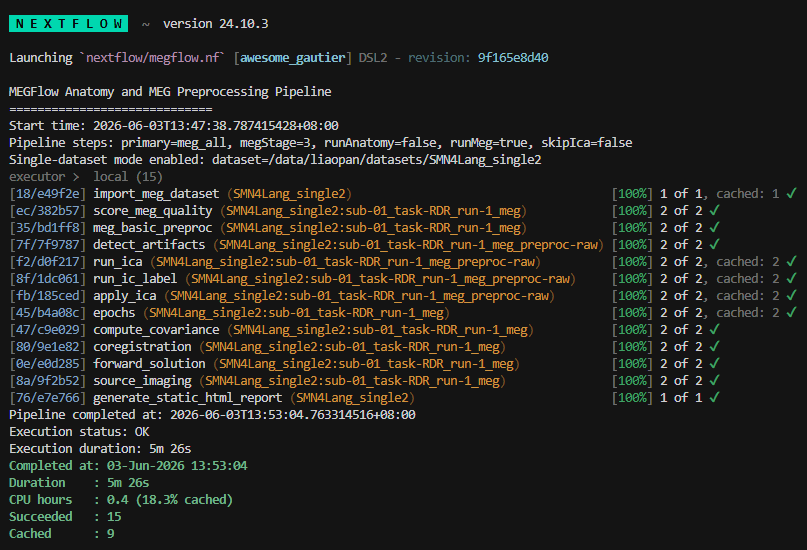
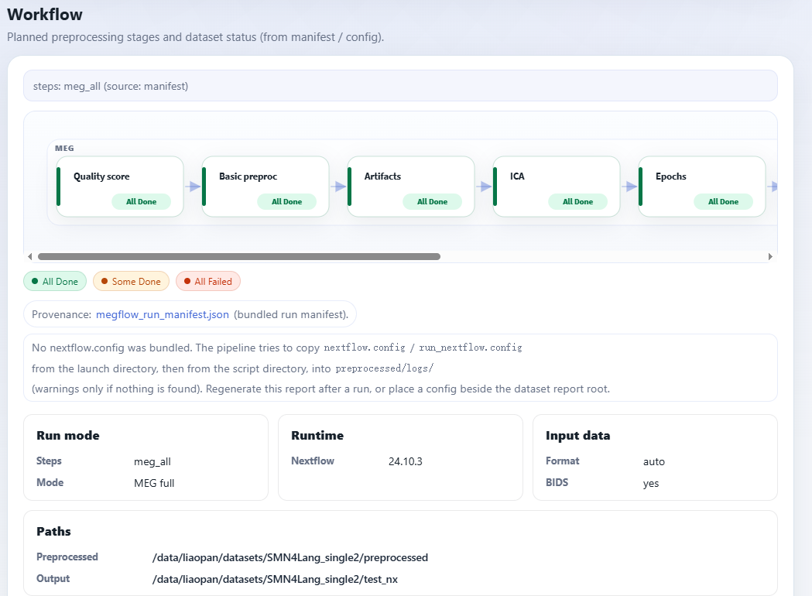
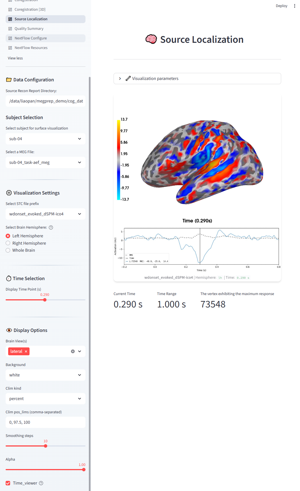

Reports
========

MEGFlow provides two report interfaces:

* A portable static HTML report generated by the Nextflow workflow.
* An interactive Streamlit report viewer started with ``-r`` or
  ``--view_report``.

The static report is the first place to inspect a completed run. The
interactive report is used when reviewers need to inspect the underlying
recording, edit sidecar files, and continue the workflow with Nextflow
``-resume``.

Downloadable Report Demonstrations
----------------------------------
A complete MEGFlow report demonstration package is available from the
`MEGFlow demonstration archive on OSF
<https://doi.org/10.17605/OSF.IO/QE93S>`__. The archive provides a complete,
self-contained static HTML report package for download and a demonstration
video showing how the interactive Streamlit report is opened and reviewed.
After extracting the static report package, open its ``index.html`` file in a
web browser; no running MEGFlow service is required.

   A MEGFlow run records selected steps, task status, cache reuse, runtime, and
   completion statistics in the Nextflow console output.

Static Processing and QC Report
-------------------------------

Every MEGFlow run that reaches a MEG milestone writes a static report under:

.. code-block:: text

   <output_dir>/static_html_report/

Open the report entry point:

.. code-block:: text

   <output_dir>/static_html_report/index.html

The static report can also be regenerated without rerunning the pipeline:

.. code-block:: bash

   docker run --rm -it \
     -v /data/bids:/input \
     -v /data/out:/output \
     -v /data/smri:/smri \
     cplmeg/megflow:1.0.0 \
     -i /input -o /output --fs_subjects_dir /smri --steps report

The report directory is self-contained and includes copied figures, sidecar
files, JSON summaries, CSV summaries, and a config snapshot when available.
Its ``nextflow/`` directory is owned by Nextflow and contains the execution
report, timeline, trace, and launcher log when available. MEGFlow regenerates
its own report assets without deleting this directory, and the dashboard links
directly to these run-level files.
Subject pages also include a collapsed ``Task Details`` table derived from the
Nextflow trace file when one is available. If a task failed or was ignored, the
page adds ``Task Failure Details`` with the error summary and packaged command
log excerpts.

Static Report Visual Tour
~~~~~~~~~~~~~~~~~~~~~~~~~

The dataset dashboard is designed for triage. Start with the selected workflow,
then move through aggregate metrics, completion status, alarm priority, and
subject-level evidence.

   The workflow diagram is rendered from ``megflow_run_manifest.json`` and the
   effective configuration. It changes with ``steps`` so reviewers can verify
   that the report matches the intended run mode.

.. grid:: 1 1 2 2
   :gutter: 2
   :class-container: megflow-screenshot-grid

   .. grid-item-card:: Dataset overview
      :class-card: megflow-screenshot-card

      .. image:: ../_static/static_reports/megflow_dataset_overview.png
         :alt: Dataset overview cards summarizing NMDQ score, bad channels, bad segments, coregistration, and epoch rejection.
         :class: megflow-card-image
         :target: ../_static/static_reports/megflow_dataset_overview.png

      Aggregate NMDQ score, bad-channel and bad-segment counts,
      coregistration distances, epoch rejection, status counts, and alarm
      totals are summarized at the dataset level.

   .. grid-item-card:: NormMEG-QC and NMDQ score
      :class-card: megflow-screenshot-card

      .. image:: ../_static/static_reports/megflow_normative_score.png
         :alt: NormMEG-QC panel showing metric-family scores, the overall NMDQ score, and thresholds.
         :class: megflow-card-image
         :target: ../_static/static_reports/megflow_normative_score.png

      NormMEG-QC summarizes metric-family scores on a fixed 0-100 scale
      together with the overall NMDQ score, processing gate, and warning
      threshold.

   .. grid-item-card:: Completion matrix
      :class-card: megflow-screenshot-card

      .. image:: ../_static/static_reports/megflow_completion_matrix.png
         :alt: Completion matrix showing which MEGFlow stages completed for each recording.
         :class: megflow-card-image
         :target: ../_static/static_reports/megflow_completion_matrix.png

      The completion matrix shows which stages completed for each recording,
      making partial runs and failed or skipped branches easy to identify.

   .. grid-item-card:: Priority review
      :class-card: megflow-screenshot-card

      .. image:: ../_static/static_reports/megflow_priority.png
         :alt: Priority review panel listing recordings with alarms that need attention.
         :class: megflow-card-image
         :target: ../_static/static_reports/megflow_priority.png

      Alarm summaries highlight recordings that should be reviewed first
      before spending time on passed subjects.

   .. grid-item-card:: Subject details
      :class-card: megflow-screenshot-card

      .. image:: ../_static/static_reports/megflow_subjects_details.png
         :alt: Subject-level static report page with alarm details, stage summaries, and task logs.
         :class: megflow-card-image megflow-card-image-tall
         :target: ../_static/static_reports/megflow_subjects_details.png

      Subject pages collect alarms, stage-level evidence, packaged files, and
      Nextflow task logs for the selected recording.

Stage-Level Evidence
~~~~~~~~~~~~~~~~~~~~

Static subject pages include stage-specific figures so reviewers can inspect
the evidence behind each warning or failed threshold.

.. grid:: 1 1 3 3
   :gutter: 2
   :class-container: megflow-screenshot-grid

   .. grid-item-card:: Artifacts
      :class-card: megflow-screenshot-card

      .. image:: ../_static/static_reports/megflow_artifacts.png
         :alt: Static report artifact section with bad-channel and bad-segment evidence.
         :class: megflow-card-image
         :target: ../_static/static_reports/megflow_artifacts.png

      Bad-channel and bad-segment evidence is packaged with the report for
      offline inspection.

   .. grid-item-card:: ICA
      :class-card: megflow-screenshot-card

      .. image:: ../_static/static_reports/megflow_ica.png
         :alt: Static report ICA section with component labels and component figures.
         :class: megflow-card-image megflow-card-image-tall
         :target: ../_static/static_reports/megflow_ica.png

      ICA labels, marked components, enabled ECG/EOG/outlier candidates,
      topographies, and overlay plots are grouped on the subject page. A
      category disabled in that recording's resolved ``ic_label`` settings is
      omitted from missing-component alarms rather than being reported as a
      failed detection.

   .. grid-item-card:: Coregistration
      :class-card: megflow-screenshot-card

      .. image:: ../_static/static_reports/megflow_coreg.png
         :alt: Static report coregistration section with alignment figures and distance summaries.
         :class: megflow-card-image
         :target: ../_static/static_reports/megflow_coreg.png

      Coregistration figures and distance summaries help confirm that each MEG
      recording was matched to the intended MRI subject.

Report Contents
~~~~~~~~~~~~~~~

.. list-table::
   :header-rows: 1
   :widths: 32 68

   * - Path
     - Description
   * - ``index.html``
     - Dataset-level dashboard with workflow diagram, aggregate metrics,
       subject table, alarm counts, and links to subject pages.
   * - ``subjects/<recording>.html``
     - Recording-level details for artifacts, ICA, coregistration, epochs,
       covariance, head model, source reconstruction, and packaged files.
   * - ``alarms.html``
     - Searchable alarm list across all recordings.
   * - ``data/dataset_summary.json``
     - Machine-readable dataset summary.
   * - ``data/subjects.csv``
     - Spreadsheet-friendly subject summary table.
   * - ``data/subjects/<recording>.json``
     - Machine-readable per-recording summary.
   * - ``data/nextflow.config.txt``
     - Nextflow runtime/project config snapshot when MEGFlow can locate one.
   * - ``data/megflow_run_manifest.json``
     - Workflow mode and run metadata used to render the workflow diagram.
   * - ``files/<recording>/errors/*.txt``
     - Packaged ``.command.err``, ``.command.log``, and ``.command.out``
       excerpts for failed or ignored tasks, when available.
   * - ``files/<recording>/tasks/*.txt``
     - Optional ``.command.log`` excerpts for successful tasks when
       ``static_task_log_mode = 'all-command-log'``.

When dataset reports are bundled into a corpus report, the sticky navigation
follows the report hierarchy. Dataset-level pages link to ``Corpus overview``;
subject pages link to their local ``Dataset overview`` so reviewing one subject
does not unexpectedly leave the current dataset.

Completion states are determined from required derivatives such as Epochs FIF,
forward FIF, covariance/rank files, and source-estimate files. Optional PNG
visualizations do not decide whether those processing stages completed.

Task Log Bundling
-----------------

By default, MEGFlow copies successful-task ``.command.log`` excerpts as well
as failed-task command logs so the portable report contains fuller task
provenance. Configure this with ``static_task_log_mode`` in the Nextflow
config. Put a shared value under ``params.megflow.defaults.report`` or override
it in a named dataset profile.

.. list-table::
   :header-rows: 1
   :widths: 28 72

   * - Value
     - Behavior
   * - ``all-command-log``
     - Default. Copy ``.command.err``, ``.command.log``, and
       ``.command.out`` excerpts for failed or ignored tasks, and also copy
       ``.command.log`` for successful tasks.
   * - ``failed``
     - Copy command logs only for failed or ignored tasks when a smaller report
       package is preferred.
   * - ``none``
     - Do not copy ``.command*`` logs. The report still shows trace-derived
       task status, exit code, duration, memory, and hash values.

Example:

.. code-block:: groovy

   params.megflow.defaults.report.static_task_log_mode = "all-command-log"

How to Interpret the Static Report
----------------------------------

Start from ``index.html``:

1. Review the workflow diagram to verify that the selected ``steps`` mode
   matches the intended run.
2. Sort the subject table by alarms, bad channels, bad segments, coregistration
   distance, or epoch rejection rate.
3. Open subject pages for recordings marked ``WARN`` or ``FAIL``.
4. For artifact alarms, inspect the bad-channel list, bad-segment table, and
   artifact mask heatmap. The heatmap summarizes where bad channels and bad
   time segments occur across the recording before opening the more detailed
   waveform images.
5. For ICA alarms, inspect marked components, ECG/EOG candidates, component
   topographies, and ICA overlay/PSD plots.
6. For coregistration alarms, inspect the staged coregistration figures and
   confirm that the recording was matched to the correct MRI subject.
7. If a subject is marked ``FAIL`` because a Nextflow task failed or was
   ignored, open ``Task Failure Details`` first, then expand ``Task Details``
   for the full trace context.

The report includes measured values, static alarms, and the NMDQ score produced
by NormMEG-QC when ``megqc.enabled = true``. See
:doc:`../reference/qc_metrics` for the complete metric list and score-gating
details.

Interactive Streamlit Report
----------------------------

To view quality control reports through the interactive Streamlit interface,
run MEGFlow with Docker and expose port ``8501``:

.. code-block:: bash

   docker run --rm -it -p 8501:8501 \
     -v /data/megflow_output:/output \
     cplmeg/megflow:<version> \
     -r

The Docker entrypoint handles mounted output permissions automatically. It
starts as root, prepares ``/output`` when needed, then drops to the host UID/GID
inferred from ``/input``. For report-only runs that only mount ``/output``, the
UID/GID are inferred from ``/output`` instead, so an existing report directory
owned by the submitting user stays writable. If neither mount has the desired
owner, pass ``-e LOCAL_UID="$(id -u)" -e LOCAL_GID="$(id -g)"``.

Then open:

.. code-block:: text

   http://<server_ip>:8501

Use ``http://localhost:8501`` when running locally. The Streamlit report is a
viewer and does not run Nextflow preprocessing.

For corpus-mode outputs, mount the output root and pass it as ``-o``:

.. code-block:: bash

   docker run --rm -it -p 8501:8501 \
     -v /data/megflow_corpus_output:/output \
     cplmeg/megflow:<version> \
     -r -o /output

The Streamlit entrypoint detects ``/output/datasets/<dataset_name>/`` and adds
a corpus dataset selector in the sidebar. After selecting a dataset, the usual
interactive pages read that dataset's ``preprocessed/`` tree. If
``/output/smri/<dataset_name>/`` exists, it is used as that dataset's
FreeSurfer ``SUBJECTS_DIR``.

Interactive Review and Editing
~~~~~~~~~~~~~~~~~~~~~~~~~~~~~~

The interactive report reads the same processing outputs used by the static
report, but allows reviewers to inspect and edit selected sidecar files. After
saving edits, rerun MEGFlow with ``-resume`` so the downstream tasks that depend
on those sidecars are recomputed.

.. grid:: 1 1 2 2
   :gutter: 2
   :class-container: megflow-screenshot-grid

   .. grid-item-card:: Artifact review
      :class-card: megflow-screenshot-card

      .. image:: ../_static/interactive_reports/megflow_artifacts_review.png
         :alt: Interactive artifact review page showing PSD, filtered waveforms, and bad-segment editing.
         :class: megflow-card-image megflow-card-image-tall
         :target: ../_static/interactive_reports/megflow_artifacts_review.png

      Review PSD and waveform evidence, edit bad channels or bad segments, and
      save corrections for resumed downstream processing.

   .. grid-item-card:: Fast artifact review
      :class-card: megflow-screenshot-card

      .. image:: ../_static/interactive_reports/megflow_artifacts_fast_review.png
         :alt: Interactive fast artifact review page using generated waveform images.
         :class: megflow-card-image
         :target: ../_static/interactive_reports/megflow_artifacts_fast_review.png

      MEGFlow can generate waveform images for quick browser review when
      ``artifact_images_enabled: true`` is configured.

   .. grid-item-card:: ICA review
      :class-card: megflow-screenshot-card

      .. image:: ../_static/interactive_reports/megflow_ICA_review.png
         :alt: Interactive ICA review page for checking and editing ICA component labels.
         :class: megflow-card-image
         :target: ../_static/interactive_reports/megflow_ICA_review.png

      Review automatic ICA labels, inspect component evidence, edit artifact
      labels when needed, and save the selected components.

   .. grid-item-card:: Coregistration review
      :class-card: megflow-screenshot-card

      .. image:: ../_static/interactive_reports/megflow_coreg_review.png
         :alt: Interactive coregistration review page for ICP and manual transform adjustment.
         :class: megflow-card-image megflow-card-image-tall
         :target: ../_static/interactive_reports/megflow_coreg_review.png

      Inspect the alignment, run ICP, manually adjust the transform when
      needed, and save the corrected coregistration matrix.

   Source review provides an interactive view of source-localization results,
   including time navigation for inspecting source estimates at different
   latencies.
